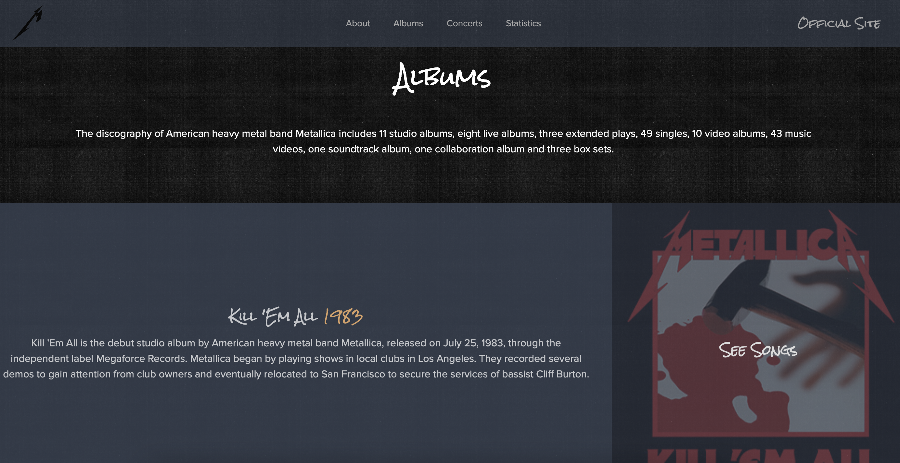

# 🎸 Metallica Fan Web Page

## 📌 About
A fan site dedicated to the band **Metallica**, built to practice integration with external APIs and modern frontend frameworks.  
The site uses **Astro** for static site generation, **React** for interactive components, and is styled with **TailwindCSS**. Data is fetched from **Spotify**, **LastFM**, and **Setlist.fm** APIs to display albums, statistics, and the latest concert setlists.  

---

## 🚀 Features
- Band member section with React state management and interactive details  
- Album and song listings from Spotify API  
- Listening statistics from LastFM  
- Latest concerts fetched from Setlist.fm  
- Responsive design with TailwindCSS  

---

## 🛠️ Stack
- **Astro** (Static Site Generation)  
- **React** (Dynamic components)  
- **TypeScript**  
- **TailwindCSS**  
- **APIs:** Spotify, LastFM, Setlist.fm  

---

## 📷 Screenshots
  
  
  
  

---

## 🔗 Links
- **Live site:** [metallica.freddyromo.dev](https://metallica.freddyromo.dev)  
- **Repository:** [GitHub Repo](https://github.com/FreddyRomoCH/metallica)  

---

## 📄 License
This project is open source and available under the [MIT License](LICENSE).  
**Disclaimer:** This is a non-commercial project made for educational purposes only. All rights to the content (band name, logos, music data) belong to their respective owners.
